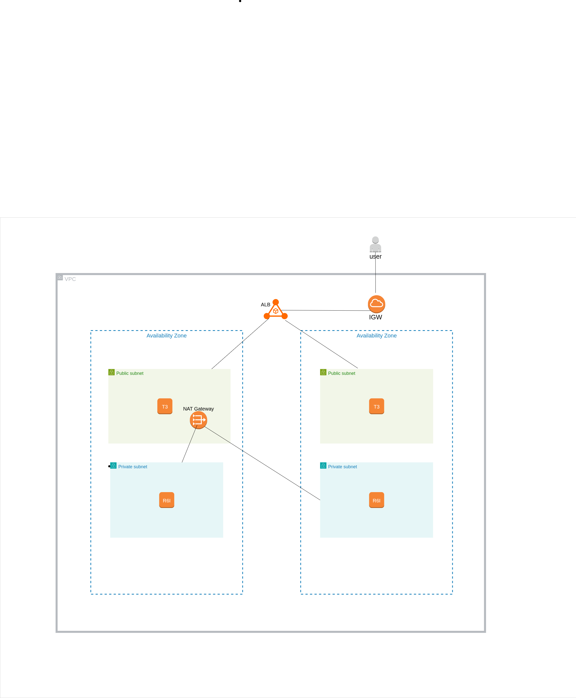

---

## **Lab Steps**

1. **Networking Setup**
   - Create VPC, public/private subnets, IGW, NAT, route tables

2. **EC2 Setup**
   - Define SG rules for frontend and backend machines.
   - Launch frontend and backend EC2s in appropriate subnets  
   - Assign public IPs only to frontends for initial testing  

3. **Application Deployment**
   - Deploy frontend app (web server)  
   - Deploy backend API (port 5000)  
   - Configure reverse proxy on frontends  

4. **ALB Setup**
   - Create public ALB across both public subnets  
   - Configure listener on port 80  
   - Create target group including both frontend EC2s  
   - Verify health checks and access site via ALB DNS  

5. **Testing**
   - Access site via ALB DNS  
   - Verify requests route to either frontend EC2  
   - Frontend communicates with local backend API  

---
 

---

## **Diagrams**

---

This lab demonstrates a **simple HA web architecture in AWS**, perfect for learning VPCs, subnets, EC2s, NAT, and ALB.  
